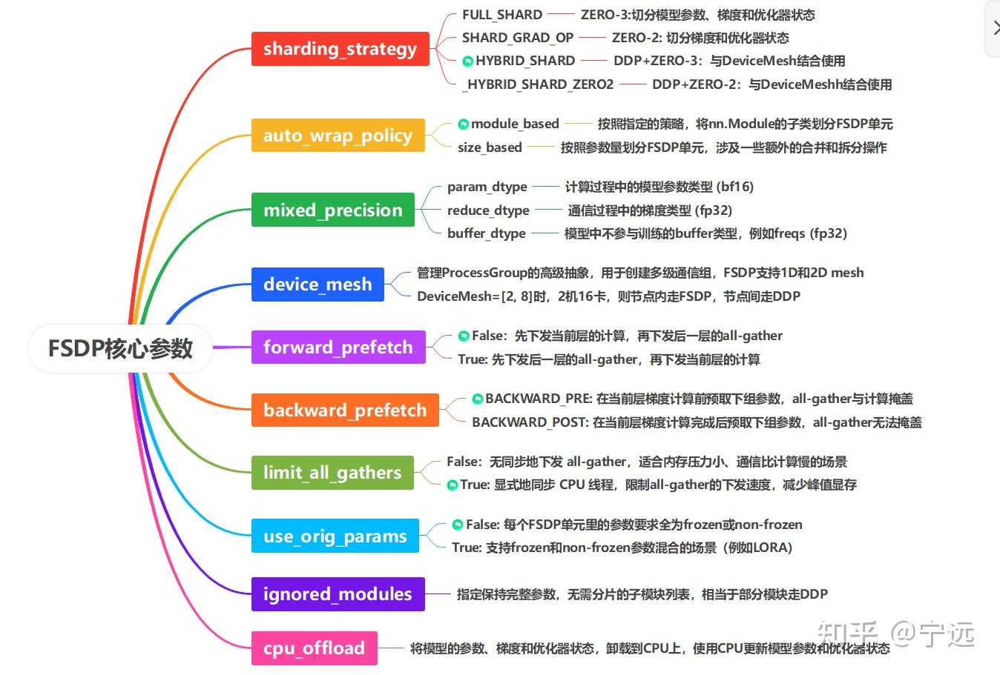
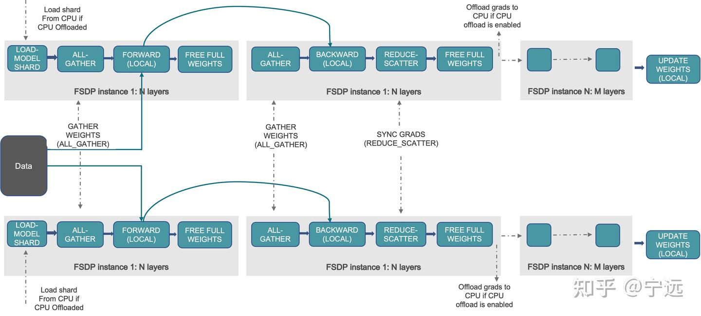
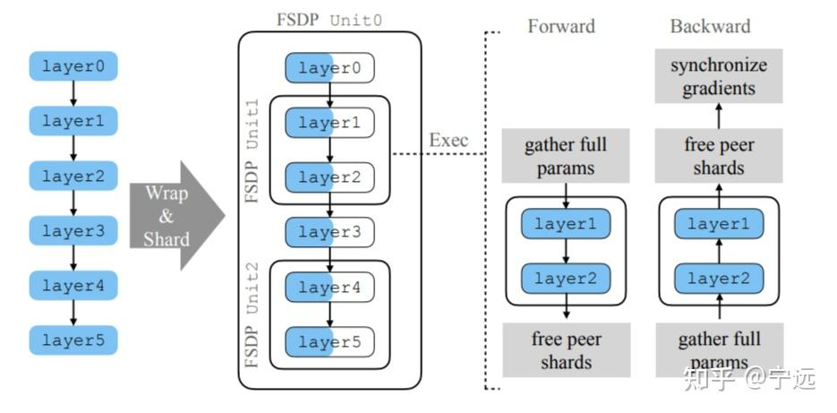
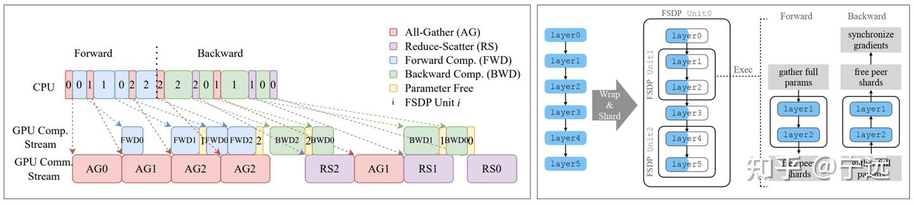

# [fsdp基本概念](https://zhuanlan.zhihu.com/p/2006736398171017994)
_FullyShardedDataParallel：a wrapper for sharding module parameters across data parallel workers._
对于一个模型或者模块，通常有两种切分思想：
**1. 使用分片后的参数执行计算，通信激活值**：例如**megatron中的张量并行**，对linear层的参数进行切分，对中间结果进行通信；优点是不需要对模型参数进行通信，缺点是这种通信不容易与计算重叠，因为连续的计算之间存在依赖关系。
**2. 通过按需通信参数，执行与完整模型相同的计算**：**ZeRO和FSDP**属于这一类，优点是参数通信不依赖前面的计算，**在通信参数的同时，可以执行与所需参数无关的计算任务**；但要求单个设备的内存可以放下通信后的参数。
## FSDP流程
各个进程保留一份本地的模型分片，以FSDP Unit为单位，通过all-gather聚合权重进行前向计算，完成后释放权重；反向传播时再次all-gather聚合权重，利用反向传播过来的误差计算本地的梯度，然后通过reduce-scatter同步梯度，释放完整权重，最后使用通信后的梯度分片更新本地的模型参数。


## FSDP单元unit
FSDP通过指定`wrap_policy`，模型实例分解为`Unit`单元
在 FSDP2 中，Unit 的本质是 **“网络通信的最小边界封装”**——每个Unit的参数、梯度和优化器状态被分散到通信组的所有设备，独立进行计算和通信；在前向和反向计算期间，FSDP一次只通信当前Unit所需的参数，而其余参数保持分片状态（暂不考虑参数预取）
- **Unit 内部：** 所有的参数都被 FSDP2 捆绑在一起。当进入这个 Unit 的前向传播时，**整个 Unit 内部的所有参数必须通过一次 NCCL All-Gather 一把组装好**。
- **Unit 之间：** 相互独立。算完 Unit 0，释放 Unit 0；准备算 Unit 1，再去 All-Gather Unit 1。
- **与卡数的关系：** 卡数（2张卡）决定的是每个 Unit 里的参数被切成几份（每份 $1/2$）；而 Unit 的数量（3个），决定的是参数分几批去进行 All-Gather。


## Transformer-based Wrap（基于 Transformer 层的递归切分）

**切分策略：逐层包裹 (Layer-by-Layer)**： 用循环遍历，给每一个 Block 穿上一件独立的外套。

**微观切分：在 Layer 内部，参数分片方法**
拿 Qwen3-VL 语言层中的一个 Qwen2DecoderLayer 举例，它里面包含 q_proj, k_proj, v_proj, o_proj 以及 MLP 的几层线性层（gate_proj, up_proj, down_proj）。

当 FSDP2 作用于该层时，它会按参数（Per-parameter）在第 0 维度进行硬切（torch.chunk(dim=0)）。
假设 q_proj.weight 的形状是 [4096, 4096]（1600万参数，约 32MB 显存），在你的单机八卡（fsdp_size=8）环境下：
- **Rank 0** 真正持有的物理内存只有：q_proj.weight[0:512, :] （大小 [512, 4096]，仅 4MB）。
- **Rank 1** 持有：q_proj.weight[512:1024, :]。
- ……以此类推。
- **梯度（Gradient）：** 形状跟权重一模一样，Rank 0 同样只保留 [512, 4096] 大小的梯度分片。
- **优化器状态（Optimizer States）：** AdamW 的 $m$ 和 $v$ 矩阵形状也一样，Rank 0 同样只为这 [512, 4096] 个位置维护动量。

## 参数管理
### DTensor


### unshard & reshard

### 参数分片实例

## 混合精度


## 通算重叠

### 通算重叠
前向阶段：
unit0：通信流执行 AG0（无法被计算掩盖），计算流随后执行 FWD0
unit1：unit0 的 FWD0 计算时，通信流启动 AG1（被计算掩盖）；AG1 完成后执行 FWD1
unit2：unit1 的 FWD1 计算时，通信流启动 AG2（被掩盖）；计算流执行 FWD2 完成前向
反向阶段：
unit2：计算流执行 BWD2，通信流随后执行 RS2
unit1：unit2 的 RS2 通信时，计算流启动 BWD1；通信流执行 RS1
unit0：unit1 的 RS1 通信时，计算流启动 BWD0；通信流执行 RS0
注意到，unit 0是在计算完成后才释放参数的，另外FWD1执行后，立刻又执行了FWD0，因为layer3的参数在AG0就已经聚合了


### 参数预取


## DeviceMesh


可结合 HSDP（混合分片数据并行）灵活定义设备拓扑

## FSDP2
引入 DTensor，移除了FlatParameters，进一步优化了通信与内存管理

## FSDP与TP的混合使用
FSDP 不关注权重形状，只需在其分片前完成 TP 的权重切分即可。FSDP 会在 forward 前 all-gather 完整权重，因此进行TP 计算时，FSDP 域的参数是完整的。


# 案例解析
以单机作为一个全分片的数据并行组。以下是该场景下，从程序启动、模型加载，到完成一个单步（Step）训练并保存权重的全流程深度拆解。
## 1. 初始化与通信组（Device Mesh）创建

在执行 `torchrun` 启动脚本后，8个独立的 Python 进程（Rank 0 至 Rank 7）在单机上并行运行。

- **分布式环境初始化 (`init_process_group`)** 所有进程通过 NCCL 后端建立连接。Rank 0 充当主节点，通过环境变量 `MASTER_ADDR` 和 `MASTER_PORT` 协调全局，构建默认的全局通信组。
    
- **创建一维 Device Mesh (设备网格)** FSDP2 摒弃了过去繁琐的 `ProcessGroup` 传参，引入了 `DeviceMesh`。由于 `fsdp_size = 8` 且只有 8 张卡，代码会创建一个一维的 `DeviceMesh("cuda", [0, 1, 2, 3, 4, 5, 6, 7])`。
    
    > **为什么引入 Device Mesh？** 它能清晰地为 DTensor 描述硬件的拓扑结构。在 FSDP2 中，所有的张量切分（Sharding）都是基于这个 Mesh 上的维度（如 `mesh_dim=0`）进行的。


## 2. 模型权重加载（元设备与延迟初始化）

如果将 Qwen3-VL 的全部完整参数直接在 CPU 或 GPU 上加载，容易直接导致内存或显存崩溃（OOM）。FSDP2 推荐采用**元设备（Meta Device）延迟初始化**机制。

### 步骤 A：构建“空壳”模型

8个 Rank 都在本地实例化 Qwen3-VL 的 Python 类，但使用 `with torch.device("meta"):` 上下文。

此时，模型的 Tensor 只有形状（Shape）和数据类型（Dtype）信息，**不分配实际的物理内存/显存**。整个 Qwen3-VL（Vision Tower、M cross-attention、Language layers）在此时的显存占用为 0。

### 步骤 B：应用 `fully_shard` 策略（递归包装）

FSDP2 通过对指定的子模块调用 `fully_shard` 函数进行包装。对于 Qwen3-VL，包装策略会深入两个核心部分：

1. **Vision 核心：** 包装 Vision Transformer 的每一个 `ViTBlock`。
    
2. **LLM 核心：** 包装 `Qwen2DecoderLayer`（即大模型内部的每个 Transformer 层）。
    

当 `fully_shard` 作用于一个层（例如第 5 层的 `Qwen2DecoderLayer`）时：

- 它会扫描该层内部的所有 Plain Tensor（如 `q_proj.weight`, `mlp.gate_proj.weight`）。
    
- 将它们转换为 **DTensor**，并指定分片规则为 `Shard(0)`（在 `mesh_dim=0` 上均匀切成 8 份）。
    
- 此时模型依然在 Meta Device 上，但它的结构已经被划分为了一个个独立的 **FSDP 单元 (FSDP Units)**。
    

### 步骤 C：实际权重真值加载

由于模型已经在 Meta Device 上划分好了分片规则，接下来需要将硬盘上的权重（如 Safetensors）填入各个卡中。FSDP2 通常使用 **DCP (Distributed Checkpoint)** 或配合存储工具实现流式或 Rank 0 广播加载：

- **Rank 0 单独加载：** 只有 Rank 0 的主机内存（CPU RAM）分块读入未分片的权重 Tensor。
    
- **分配 GPU 显存：** 8张卡各自在自己的 GPU 显存上为自己应得的那 **1/8 权重切片** 申请物理显存空间。
    
- **广播与本地切分：** Rank 0 通过 NCCL 将数据分发出去，或者各卡利用 DCP 机制直接从磁盘并行读取自己对应的那个数据块（Chunk）。
    
- 加载完成后，原先 Meta 状态的 DTensor 变成了真正驻留在各卡显存里的**分片物理 Tensor**（Sharded Parameters）。
    

## 3. 前向计算与通信重叠过程

数据 Batch 被切分为 8 份，每张卡拿到 1/8 的本地 Batch（Data Parallel 原理）。现在，前向计算（Forward）正式开始。整个模型是一层接一层串行计算的。

我们以其中一层 `Qwen2DecoderLayer_i` 的计算为例：

```
[进入该层] -> NCCL All-Gather (8卡拼出完整权重) -> 前向矩阵乘法 (本地数据 × 完整权重) -> 释放完整权重 (只留1/8分片) -> [进入下一层]
```

1. **静态 Prefetch（预取）触发：** 在计算第 $i-1$ 层时，FSDP2 的流控引擎已经通过底层 CUDA Event 偷偷向 NCCL 发出指令：**异步 All-Gather 第 $i$ 层的权重**。
    
2. **All-Gather 通信：** 8张卡伸出“触角”，互相把自己手里的这 1/8 权重传给其他卡。在当前 `Qwen2DecoderLayer_i` 计算真正开始前，每张卡的显存里都会临时拼出一个**完整的、未分片的该层权重**。
    
3. **Local Forward（本地计算）：** 当前卡的本地隐藏状态（Hidden States）与这个刚刚拼好的完整权重进行矩阵乘法（如 $X \cdot W$）。
    
4. **显存瞬间释放 (Reshard)：** 一旦该层的 `forward()` 计算流（Stream）完成，FSDP2 会**立刻**将除了自己原有的 1/8 之外的其余 7/8 临时权重从显存中擦除（Free）。
    
5. **跨模态处理：** 当图像特征通过被完全分片的 `ViTBlock` 计算完毕后，得到的视觉 Token 接入到语言层，后续的语言层同样重复这种“All-Gather $\rightarrow$ 计算 $\rightarrow$ 释放”的循环。
    

## 4. 反向计算、重计算（Activation Checkpointing）与 Offload

反向传播（Backward）是显存压力最大、通信最密集的阶段。

### A. 激活值重计算 (Activation Checkpointing) 的行为

在 Qwen3-VL 这种长文本或多模态场景下，前向传播中产生的中间激活值（如 Attention Matrix）极其庞大。

- **前向阶段：** 包装了重计算的层，在前向计算完后，**立刻把中间激活值销毁**，只保留该层最原始的输入输入张量（Input Tensor）。
    
- **反向阶段：** 当反向传播的链式求导流到达这一层时，它会利用刚才保留的输入张量，**重新执行一次该层的前向计算**，现场临时把中间激活值算出来，供反向梯度计算使用。算完后再次立即销毁。
    

### B. 激活值 Offload (若开启)

如果开启了 `CPUOffload`，在前向计算产生激活值后，PyTorch 会通过异步的 PCIe 通道，把这些激活值转移（Offload）到主机的 **CPU 内存** 中。在反向需要时，再通过 PCIe 提前拉回到 GPU。本场景中单机八卡 NVLink 速度极快，通常优先使用重计算而非 Offload。

### C. 反向计算与通信重叠（核心高潮）

反向计算是从最后一层（Loss 层及 Language 头）反向往第一层（Vision 入口）推导的。同样以 `Qwen2DecoderLayer_i` 为例：

1. **反向预取 (Backward Prefetch)：** 当在对第 $i+1$ 层求导时，FSDP2 已经异步发起了第 $i$ 层权重的 **All-Gather**，确保第 $i$ 层反向求导时完整权重已就位。
    
2. **计算本地梯度：** 结合拼好的完整权重和（重计算出的）激活值，GPU 计算出对输入 X 的梯度（传给前一层）以及**对当前层参数的完整梯度（Unsharded Gradients）**。
    
3. **Reduce-Scatter 通信（梯度同步与切分）：**
    
    由于每张卡上带的本地数据不同，算出来的完整梯度也不同。此时，8张卡立即执行 **Reduce-Scatter** 操作。
    
    - NCCL 在各卡之间规约（Sum）这些梯度。
        
    - **关键点：** 规约的同时，它把完整的梯度打碎，**每张卡最终只保留自己对应的那 1/8 权重所产生的 1/8 梯度分片（Sharded Gradients）**。
        
4. **权重与临时梯度销毁：** 规约一结束，该层临时拼出来的完整权重、以及别的卡负责的 7/8 完整梯度，被全部从显存擦除。
    

## 5. 梯度更新过程 (Optimizer Step)

当第一层（Vision 底部）的 Reduce-Scatter 也结束后，反向传播彻底完成。此时，显存里的状态是：

- 每张 GPU 上只留有整个 Qwen3-VL 模型 **1/8 的权重分片**。
    
- 每张 GPU 上只留有整个 Qwen3-VL 模型 **1/8 的梯度分片**。
    

### 步骤一：梯度裁剪 (Gradient Clipping)

在大模型训练中，为了防止梯度爆炸，需要进行全局梯度裁剪（Max Norm）。

在 FSDP2 中，由于各卡只有局部 DTensor 梯度，各卡首先在本地计算自己这 1/8 梯度的平方和。然后通过一次轻量级的 **All-Reduce**（只传输一个标量数值）把全网所有梯度的平方和加起来，开方得到全局的 $L_2$ 范数。如果超过设定阈值，各卡在本地等比例缩放自己的 1/8 梯度分片。

### 步骤二：优化器更新 (`optimizer.step()`)

假设使用 AdamW 优化器，它需要维护一阶动量 $m$ 和二阶动量 $v$。

- **完全并行：** 8张卡独立并行地更新自己本地的那 1/8 参数。
    
- **显存零冗余：** 既然卡 0 只拥有 1/8 的权重和梯度，它的 AdamW 就只针对这 1/8 的数据去计算 $m$ 和 $v$。这意味着**优化器状态（Optimizer States）在 8 张卡间也是绝对隔离且完全分片的**。
    
- 各卡利用本地的 1/8 梯度，更新本地的 1/8 权重，整个过程完全不需要任何网络通信。
    

## 6. 保存权重 (Save Checkpoint)

一个 Step 结束，或者到了特定的存储步数，需要将完整的模型参数或者分片参数 dump 到磁盘。在 FSDP2 中，推荐采用两种模式：

### 模式一：分布式高并发存储 (Distributed Checkpoint - DCP)

- **行为：** 8张卡不需要进行权重的拼合通信。
    
- **过程：** 它们直接各自调用底层的存储 API，把自己显存里的这 1/8 权重分片（以 DTensor 附带的全局元数据为索引）异步或同步地写入磁盘的独立分片文件中（通常是一个统一的文件夹，内含多个 shard 文件）。
    
- **优点：** 没有任何吞吐瓶颈，完美压满 I/O，在大规模集群中极为常用。
    

### 模式二： Rank 0 汇总流式存储 (State Dict Offload)

- **行为：** 如果用户需要最终生成一个单一的、类似于 HuggingFace 格式的 `model.safetensors` 单文件。
    
- **过程：** FSDP2 提供特定的上下文管理器。系统会隐式地逐层（Layer-by-Layer）发起 **All-Gather**。
    
    - 当第 1 层的 8 个分片在网络中拼好后，数据**立刻被传输并 Offload 到 Rank 0 进程的 CPU 内存**中。
        
    - GPU 侧立即释放该层，再去拼第 2 层。
        
    - Rank 0 的 CPU 内存像流水线一样，逐步接收并组装起整棵完整的模型树。
        
    - 最后，由 **Rank 0 单独执行磁盘写入**，将完整的权重写成单文件。这种方式保证了其他 7 张 GPU 的显存完全不会因为“保存权重”而发生严重的峰值突变或 OOM。
        

### 视频推荐

为了更直观地理解分布式训练中的通信与显存重叠优化，可以观看这个关于 PyTorch FSDP 的深入解析：

[FSDP分布式训练原理与进阶](https://www.youtube.com/watch?v=SgRKWKwQbQE)

这个视频由并行计算专家详细讲解了 FSDP1 到 FSDP2 的接口演进，并深入剖析了如何通过配置不同的设备网格（Device Mesh）和精细化分片策略来榨干 GPU 的最后一滴性能，非常适合用来建立前反向通信时序的具象化认知。


## 面经问题
### Q：FSDP和HSDP的通信量如何计算 在同样都存在跨机的情况下，HSDP和FSDP谁的性能一般会好一点，HSDP多了什么通信，为什么多了通信还能达到更好的性能


### Q：在开启了梯度累计的情况下，FSDP和FSDP+EP的异同点


### Q：在GBS固定的情况下，梯度累计次数怎么设置，跟并行方式有关系吗，分析一下优劣势


### Q：FSDP2的DTensor相比于FSDP1的FlatParam会不会引入多次启动的开销


### Q：FSDP和其他并行方式如TP、PP如何选，从通信角度谁更优，能互相达到对方的理论分布式效果吗 为什么选择FSDP


### Q：如何评判当前的分布式效果，在scaling后线性度如何


### Q：如何根据通算掩盖情况推测线性度


### Q：FSDP的参数通信、常用的卸载手段、计算等都分别使用是什么带宽，会互相影响吗，如何影响


### Q：FSDP和megatron之间如何选择


### Q：从流、前反向的通算掩盖角度，怎么看fsdp的原理


