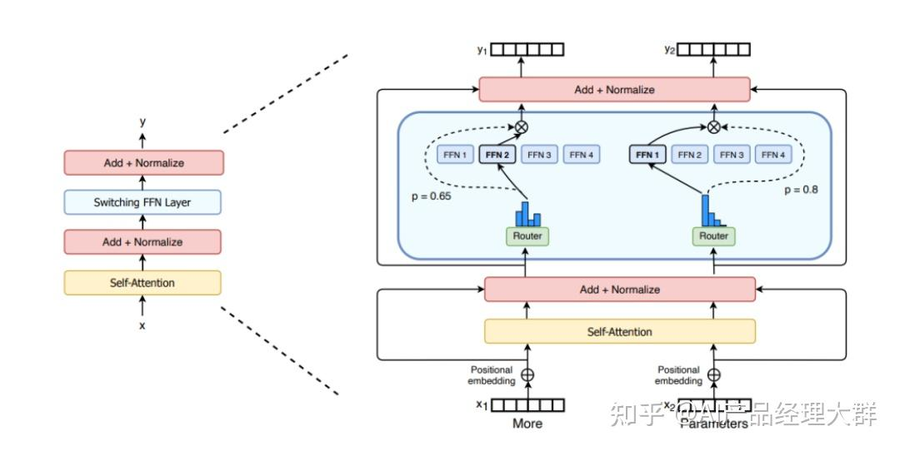
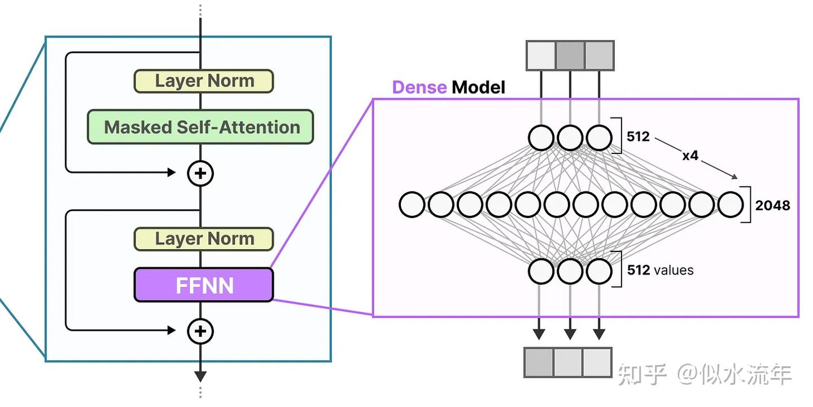
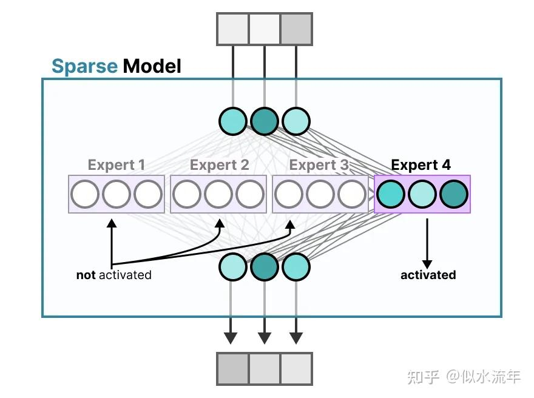
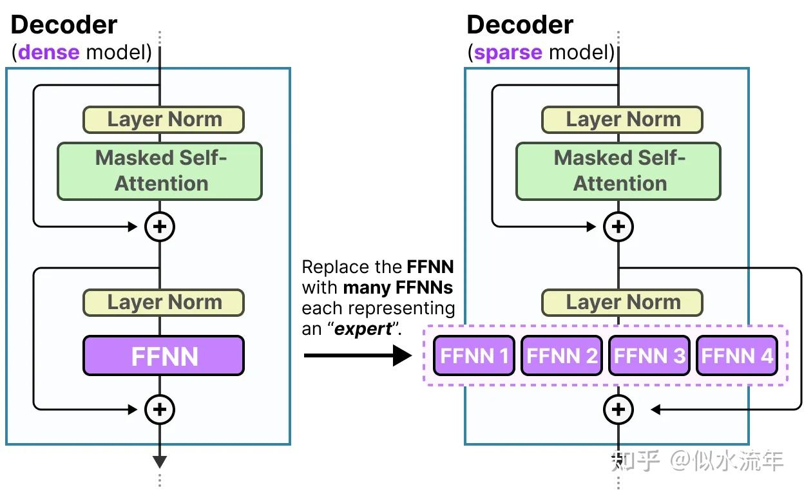
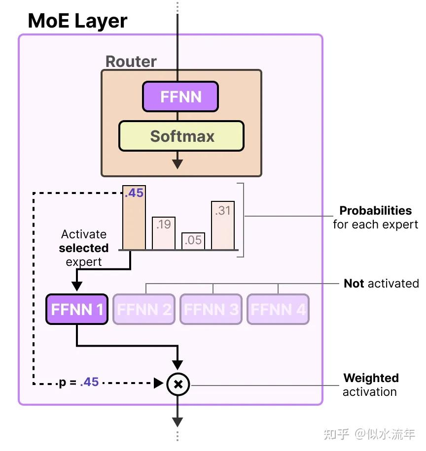
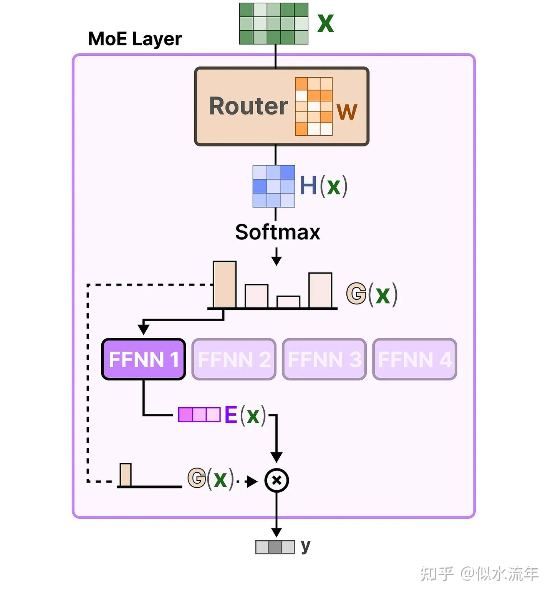

# 混合专家模型（MoE，Mixture of Experts）
https://zhuanlan.zhihu.com/p/81886457827
## 结构
- **专家（Experts）** ：每一层前馈神经网络（FFNN）不再是一个单一结构，而是由多个“专家”组成。每个“专家”本质上也是一个前馈神经网络。
- **路由器（Router）或[门控网络](https://zhida.zhihu.com/search?content_id=265388295&content_type=Article&match_order=1&q=%E9%97%A8%E6%8E%A7%E7%BD%91%E7%BB%9C&zhida_source=entity)（Gate Network）** ：负责决定每个 token（词元）应该被送到哪些专家那里去处理。
这些专家擅长处理某些特定上下文中出现的特定 token，而路由器（或门控网络）的作用，就是根据输入内容选择最合适的专家来处理每个 token
### Moe的优点
1. 任务特异性：采用混合专家方法可以有效地充分利用多个专家模型的优势，每个专家都可以专门处理不同的任务或数据的不同部分，**在处理复杂任务时取得更卓越的性能**。各个专家模型能够针对不同的数据分布和模式进行建模，从而显著提升模型的准确性和泛化能力，因此模型可以更好地适应任务的复杂性。
2. 灵活性：混合专家方法展现出**卓越的灵活性**，能够根据任务的需求灵活选择并组合适宜的专家模型。模型的结构允许根据任务的需要动态选择激活的专家模型，实现对输入数据的灵活处理。这使得模型能够适应不同的输入分布和任务场景，提高了模型的灵活性。
3. 高效性：由于只有少数专家模型被激活，大部分模型处于未激活状态，混合专家模型具有很高的稀疏性。这种稀疏性带来了**计算效率的提升**，因为只有特定的专家模型对当前输入进行处理，**减少了计算的开销**。
4. 表现能力：每个专家模型可以被设计为更加专业化，能够更好地捕捉输入数据中的模式和关系。整体模型通过组合这些专家的输出，提高了对复杂数据结构的建模能力，从而增强了模型的性能。
5. **可解释性**：由于每个专家模型相对独立，因此模型的决策过程更易于解释和理解，为用户提供更高的可解释性，这对于一些对模型决策过程有强解释要求的应用场景非常重要。
6. **适应大规模数据**：混合专家方法是处理大规模数据集的理想选择，能够有效地应对数据量巨大和特征复杂的挑战，可以利用稀疏矩阵的高效计算，利用GPU的并行能力计算所有专家层，能够有效地应对海量数据和复杂特征的挑战。

## 专家模块
### 稠密层
混合专家模型（MoE）的出发点，是 LLM 中最基础的组件之一：**前馈神经网络（FFNN, Feedforward Neural Network）**——出现在自注意力(Self-Attention)或交叉注意力(Cross-Attention)之后。它将输入向量(通常是多头注意力输出)映射到更高维度进行非线性变换，然后再映射回原维度或者另一个目标维度。
### 稀疏层
传统 Transformer 中的 FFNN 被称为**稠密模型（dense model）** ，因为它的所有参数（包括权重和偏置）在每次前向传播时都会被激活。所有部分都会参与运算，没有遗漏。
稀疏模型（sparse models） **只激活部分参数**

## 路由机制
路由器本身也是一个前馈神经网络（FFNN），它的作用是：根据每个 token 的输入内容，输出一组概率值，并据此选择最匹配的专家
将输入 token 表示向量 x ，乘以一个路由权重矩阵 W，对打分结果做 SoftMax，得到一个不同专家的概率分布 G ( x )，然后根据这些概率值，选出和输入最相关的专家，最后把每个路由器的输出与对应的专家相乘，加权求和，得到该 token 的最终输出

## 负载均衡
让每个专家在训练和推理中都能被公平地使用，避免某在某几个专家上过拟合，让不同专家的使用更加平衡
KeepTopK 策略

