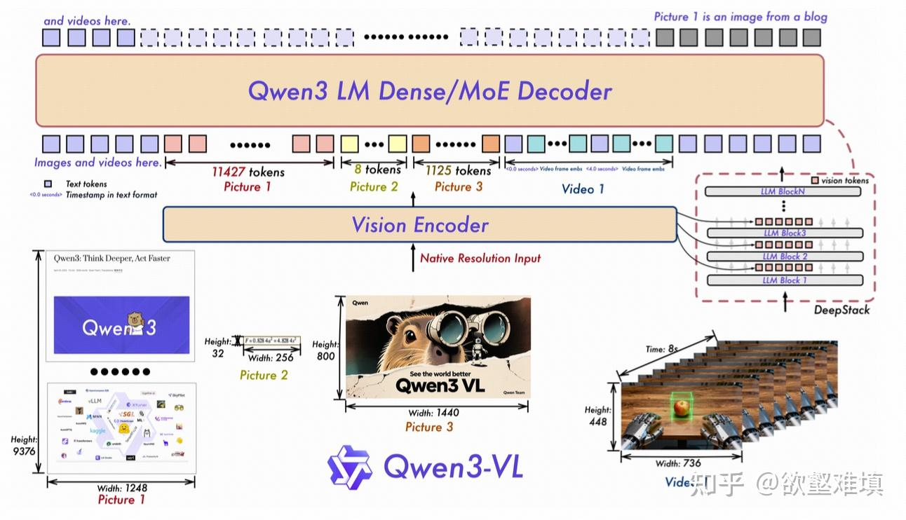
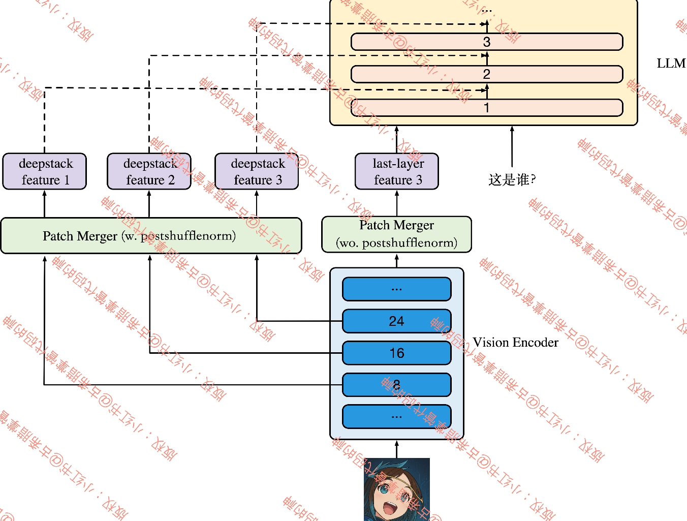
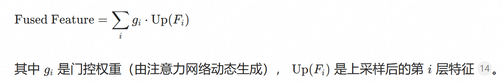
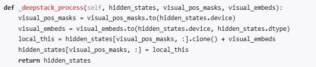

# Qwen3vl moe
[可以参考qwen2.5vl的知乎文章](https://zhuanlan.zhihu.com/p/1921289925552210138)
## 核心特性与创新：
1. 架构主要改进(对比Qwen2.5-VL)：使用的**DeepStack**的Projector整合多层级VIT特征提升视觉-语言对齐效果，**LLM支持MoE和Dense不同架构**。替换MRoPE为**interleaved-MRoPE（交错式MRoPE）**，强化图像/视频的时空特征建模的稳定性。
2. 长上下文支持：原生支持**256K tokens 的长上下文**，可无缝处理交错式文本、图像及视频输入。
3. 增强的后训练：在**多个细分领域进行RL**，采用Qwen团队的SAPO。

模型结构：**视觉编码器 + 特征融合器 + 语言大模型**

## Vision Encoder 
### 关键技术：
- 使用 **SigLIP-2 视觉编码器**（替代旧版自研ViT），专为图文对齐优化。
- **输入处理**：图像被切成小方块（patches），每个方块通过神经网络生成特征向量。
- **关键改进**：支持**动态分辨率**，不同尺寸图片无需强制缩放，避免细节丢失

## 交错式MRoPE
原始MRoPE将特征维度按照时间（t）、高度（h)和宽度（w)的顺序分块划分，使得时间信息全部分布在高频维度上。在 Qwen3-VL 中采取了 t,h,w 交错分布的形式

## DeepStack 特征融合器：多层细节整合
可以把传统方法想象成**只看一眼照片再讲故事**；  
而 DeepStack 就像**在讲故事的过程中不断看回照片**，从不同角度捕捉细节，让生成结果更加准确、生动。
**为什么需要**？传统模型只用ViT最后一层特征（已高度抽象），会丢失边缘、纹理等细节。
**工作原理**：
- **提取多层特征**：从ViT的浅层（抓边缘）、中层（抓物体部件）、深层（抓整体语义）分别提取特征
- **跨层级对齐融合**：
	- 用**上采样+位置校正**统一不同层的分辨率差异。
	- **门控加权融合**：自动判断哪层特征更重要（例如OCR任务更依赖浅层细节）：

在文本解码阶段持续注入来自视觉编码器中间层的特征，使语言生成过程始终受到视觉语义的引导，模仿了人类“边看边思考”的认知模式。

### deepstack_process 函数：
**找出视觉对应位置的掩码 visual_pos_masks；将这些位置的文本隐藏状态与视觉嵌入相加；更新隐藏状态，使语言特征中带入视觉信息。**

## LLM
- **基础模型**：基于 **Qwen3 语言模型**。
- **多模态输入方式**：
    - 视觉特征通过 **MLP投影层** 转换为与文本相同的向量维度。
    - **拼接输入**：`[视觉特征][文本token]` 一起送入语言模型，让模型同时"看图"和"读字"。

# Qwen3.5

# deepseek v4

# GLM5

# wan2.2

# qwen image

# InternVL3.5

# Kimi K2.5

